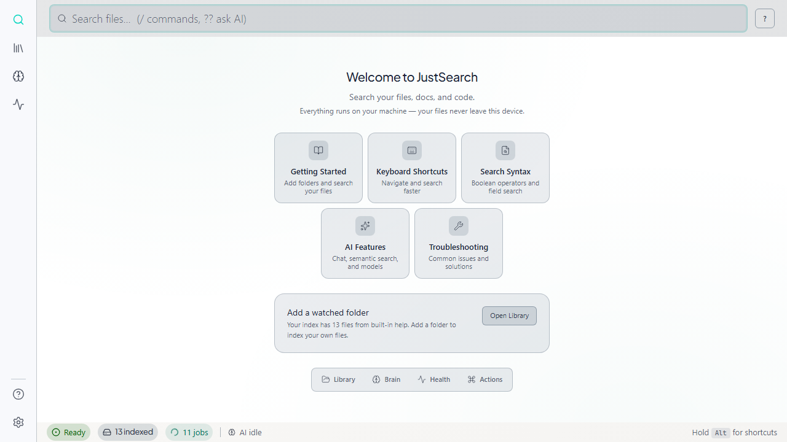
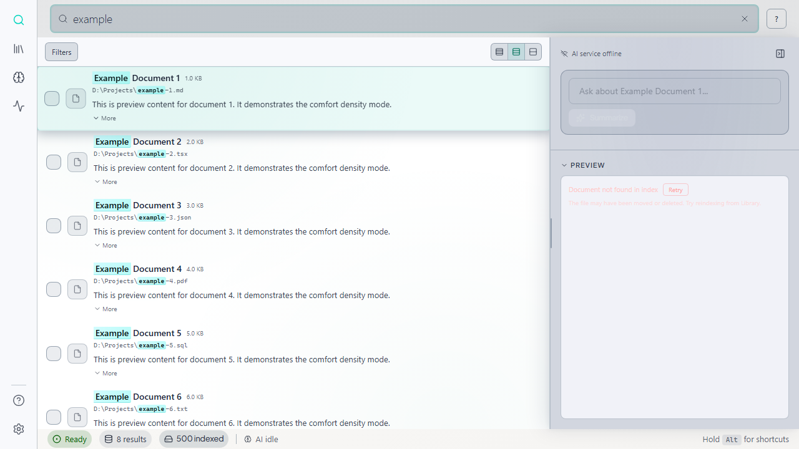
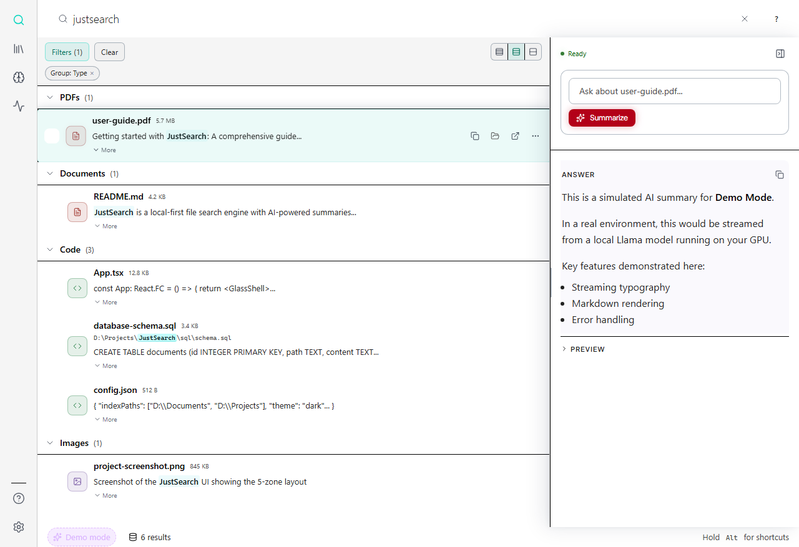
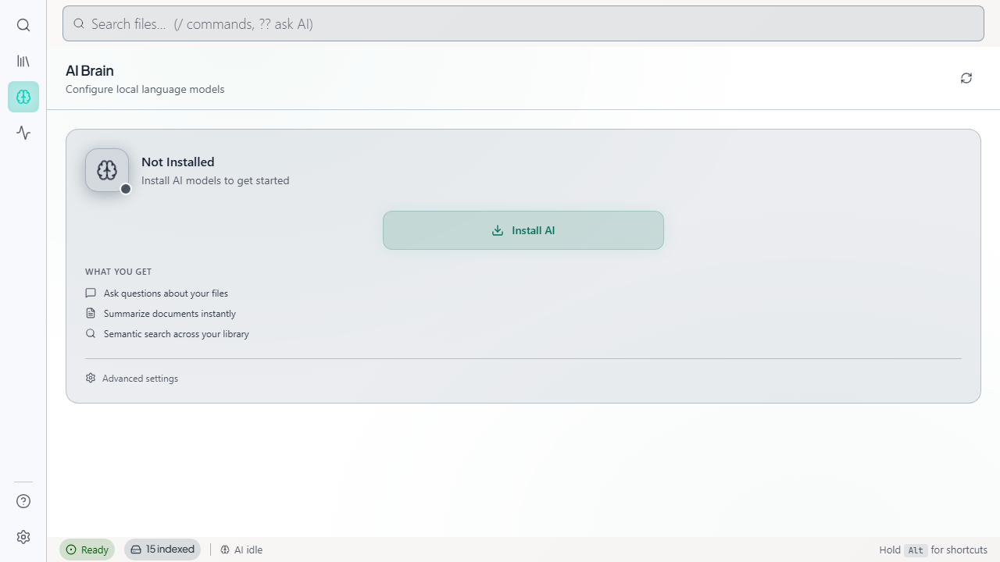

# JustSearch

**Local-first neural search for your personal files.**

Search and ask questions across your documents, code, and files — get answers grounded in cited sources you can verify instantly. All processing happens on your machine. Your data never leaves your device.



---

## The Problem

Knowledge workers drown in files. Documents scattered across folders, codebases spanning thousands of files, PDFs from years of work — finding the right information means context-switching between tools, remembering folder structures, and hoping keyword search catches what you need.

Cloud AI assistants can help, but they require uploading sensitive data to external servers. For developers, researchers, and professionals handling proprietary or confidential information, this isn't an option.

## The Solution

JustSearch brings AI-powered search to your local files with complete privacy:

- **Semantic Search**: Find documents by meaning, not just keywords. Ask "notes about the Q3 budget discussion" and find relevant files even if they don't contain those exact words.

- **Cited Answers**: Get AI-generated answers with clickable citations. Every claim links back to the exact source passage — verify anything with one click.

- **100% Local**: Runs entirely on your machine using local LLMs. No cloud uploads, no API keys, no subscription required for core features.

- **Mixed Corpus**: Search across code, PDFs, documents, and images (via OCR) in one unified interface.



---

## Key Features

### Answer Engine with Citations
Ask questions about your files and get answers backed by source citations. Click any citation to jump directly to the relevant passage.



*Screenshot shows Demo Mode, which allows testing AI features without GPU hardware. In production, responses come from local LLM inference.*

### AI-Powered Understanding
Local LLM inference for semantic search, document summarization, and conversational Q&A. Works with your GPU for fast responses, or falls back to CPU when needed.



### Privacy by Design
- All indexing and inference happens locally
- No cloud telemetry — local-only logs and metrics for debugging
- Your files stay on your machine

### Built for Builders
Optimized for developers and technical knowledge workers:
- Index codebases alongside documentation
- Fast incremental indexing with file watching
- Keyboard-driven interface

---

## Technical Highlights

JustSearch uses a **three-process architecture** that brings cloud-grade resilience to desktop:

| Process | Role | Technology |
|---------|------|------------|
| **Head** | UI + API Gateway | Java (Javalin), React, Tauri |
| **Body** | Indexing + Search + Embeddings | Lucene, Apache Tika, in-process llama.cpp |
| **Brain** | AI Generation (Chat, Q&A) | llama-server (llama.cpp) |

This design ensures:
- **Crash isolation**: A problematic PDF won't crash the UI
- **Resource management**: Heavy indexing doesn't freeze your interface
- **Graceful degradation**: No GPU? Falls back to keyword search seamlessly

[Learn more about the architecture →](docs/architecture.md)

---

## Market Opportunity

The personal knowledge management and enterprise search markets are experiencing rapid growth, driven by:

- **AI PC adoption**: Consumer GPUs increasingly capable of running local LLMs
- **Privacy regulation**: GDPR, CCPA, and industry compliance making cloud uploads problematic
- **Knowledge worker productivity**: Average worker spends 2+ hours/day searching for information

JustSearch targets the underserved intersection: users who need AI-powered search but cannot or will not upload sensitive data to cloud services.

**Target segments**:
- Developers searching codebases + documentation
- Researchers managing literature and notes
- Professionals in regulated industries (legal, healthcare, finance)

[Read the full market analysis →](docs/market-opportunity.md)

---

## About the Founder

**Elias Justus** — 19-year-old solo developer from Germany.

I started building JustSearch to solve my own problem: finding information across scattered files without uploading everything to the cloud. What began as a personal project evolved into a full desktop application with a distributed architecture typically found in cloud systems.

**Technical background:**
- Self-taught developer, building since age 15
- Focus on systems programming (Java, Rust) and desktop applications
- Abitur (German high school diploma) with advanced courses in Mathematics, Physics, and English

**What I've built:**
- Three-process architecture with crash isolation and graceful degradation
- Custom gRPC + memory-mapped file IPC layer for Windows
- Integration of Lucene (search), Apache Tika (content extraction), and llama.cpp (local AI)
- React + Tauri desktop shell with real-time file watching

JustSearch represents 12+ months of focused development, solving hard problems around Windows file locking, VRAM management, and local LLM integration.

---

## Roadmap

JustSearch is under active development. Current focus is on stability and core search quality.

**Future directions** (6-12+ months):

| Feature | Description |
|---------|-------------|
| **Cloud Connectors** | Index Google Drive, Slack, GitHub without uploading — pull data locally |
| **Audio Intelligence** | Transcribe meetings and voice notes, search by spoken content |
| **Smart Organization** | AI-assisted file organization and deduplication |
| **Contextual Feeds** | Proactive daily digests of changes in watched folders |

[View detailed roadmap →](docs/roadmap.md)

---

## Downloads

### Latest Release: [v0.1.0-alpha](https://github.com/eliasjustus/justsearch-releases/releases/tag/v0.1.0-alpha)

> **Alpha release** — Functional but early. Expect rough edges.

- [Windows Installer (x64)](https://github.com/eliasjustus/justsearch-releases/releases/download/v0.1.0-alpha/JustSearch-0.1.0-alpha-win64-setup.exe) — 1.2 GB

### Verify Your Download (Optional)

```powershell
(Get-FileHash .\JustSearch-0.1.0-alpha-win64-setup.exe -Algorithm SHA256).Hash
```

Compare with the checksum in [`SHA256SUMS.txt`](https://github.com/eliasjustus/justsearch-releases/releases/download/v0.1.0-alpha/SHA256SUMS.txt) from the release.

### System Requirements

| Component | Minimum | Recommended |
|-----------|---------|-------------|
| OS | Windows 10 (64-bit) | Windows 11 |
| RAM | 8 GB | 16 GB |
| Storage | 500 MB + index space | SSD recommended |
| GPU | None (CPU fallback) | NVIDIA 8GB+ VRAM |
| GPU (Best experience) | — | NVIDIA 12GB+ VRAM |

---

## Demo

> **Video coming soon** — Check back for a walkthrough of core features.

---

## Documentation

- [Product Overview](docs/overview.md)
- [Architecture](docs/architecture.md)
- [Roadmap](docs/roadmap.md)
- [Market Opportunity](docs/market-opportunity.md)
- [Privacy Policy](PRIVACY.md)
- [Third-Party Notices](THIRD_PARTY_NOTICES.txt)

---

## License

JustSearch is licensed under the [Apache License 2.0](LICENSE).

---

## Contact

**Elias Justus**
- Email: eliasjustus457@gmail.com
- GitHub: [@eliasjustus](https://github.com/eliasjustus)
- Location: Germany

For questions, feedback, or partnership inquiries — reach out directly.

---

*Built with privacy in mind. Your files, your machine, your answers.*
