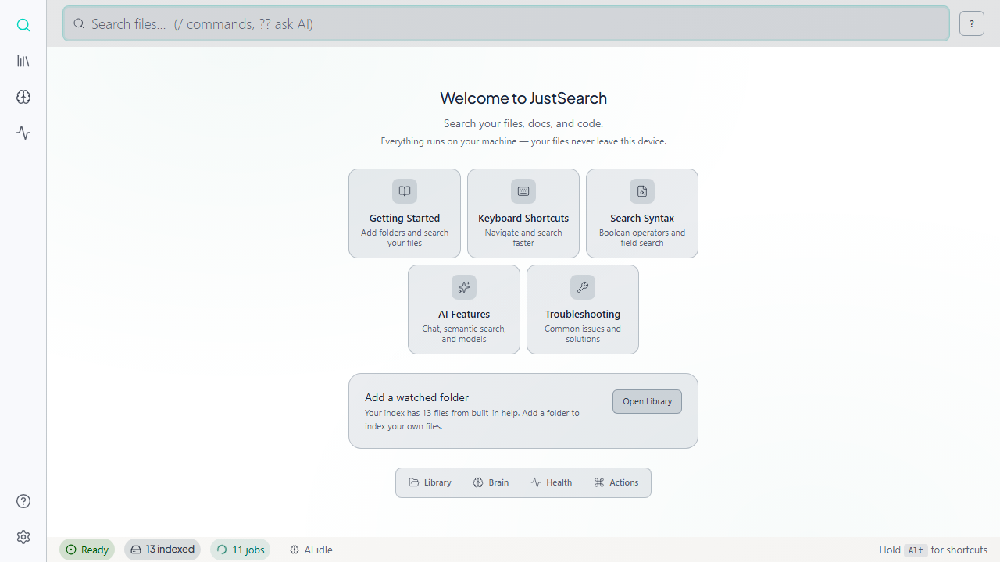
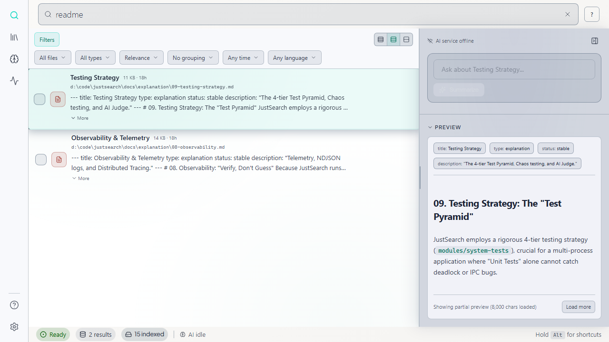
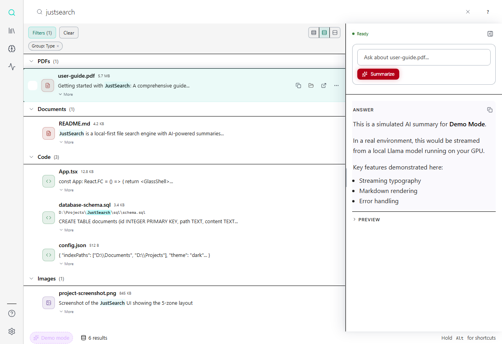
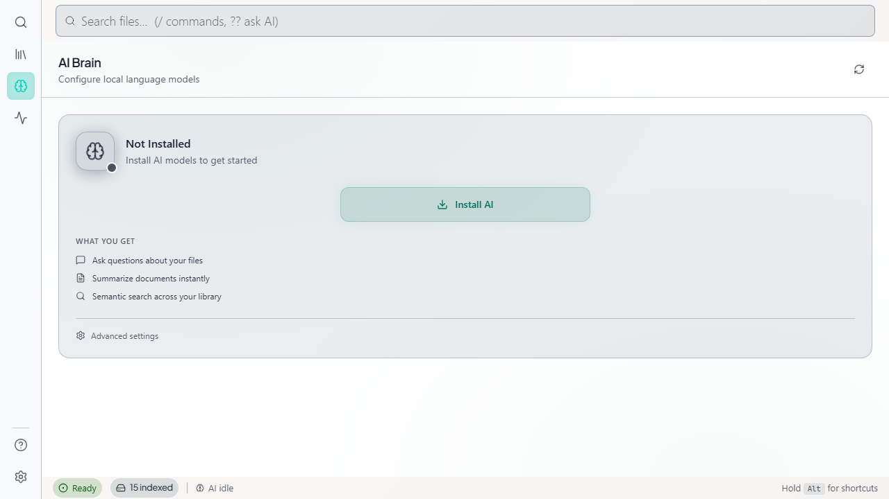

# JustSearch

**Local-first neural search for your personal files.**

Search and ask questions across your documents, code, and files — get answers grounded in cited sources you can verify instantly. All processing happens on your machine. Your data never leaves your device.



---

## The Problem

Knowledge workers drown in files. Documents scattered across folders, codebases spanning thousands of files, PDFs from years of work — finding the right information means context-switching between tools, remembering folder structures, and hoping keyword search catches what you need.

Cloud AI assistants can help, but they require uploading sensitive data to external servers. For developers, researchers, and professionals handling proprietary or confidential information, this isn't an option.

## The Solution

JustSearch brings AI-powered search to your local files with complete privacy:

- **Hybrid Neural Search**: Three retrieval paradigms — keyword (BM25), dense vectors, and learned sparse retrieval (SPLADE) — run in parallel and fuse results. A cross-encoder reranker refines the final ranking.

- **Cited Answers**: AI-generated answers with clickable citations. Every claim links back to the exact source passage — verify anything with one click.

- **1,400+ File Formats**: Indexes PDF, email, Office documents, code, images (via OCR), and hundreds more via Apache Tika. Named entity extraction enables filtering by people, organizations, and dates.

- **100% Local**: Runs entirely on your machine using local LLMs. No cloud uploads, no API keys, no subscription.

- **Agent-Ready via MCP**: Exposes retrieval through the [Model Context Protocol](https://modelcontextprotocol.io/), so any AI agent can use JustSearch as a private retrieval backend.



---

## Key Features

### Answer Engine with Citations
Ask questions about your files and get answers backed by source citations. Click any citation to jump directly to the relevant passage.



*Screenshot shows Demo Mode, which allows testing AI features without GPU hardware. In production, responses come from local LLM inference.*

### AI-Powered Understanding
Local LLM inference for semantic search, document summarization, and conversational Q&A. Works with your GPU for fast responses, or falls back to CPU when needed.



### Privacy by Design
- All indexing and inference happens locally
- No cloud telemetry — local-only logs and metrics for debugging
- Search queries are redacted from logs
- Your files stay on your machine

### Built for Builders
- Index codebases alongside documentation
- Fast incremental indexing with file watching
- Keyboard-driven interface

---

## How It Works

### Search Pipeline

When you type a query, JustSearch runs up to three retrieval methods in parallel, fuses the results, and refines the ranking:

| Stage | What Happens |
|-------|-------------|
| **Retrieval** | BM25 keyword search, dense KNN vectors (nomic-embed-text), and SPLADE learned sparse retrieval run in parallel |
| **Fusion** | Results are combined via convex combination with per-leg weights. A separate chunk-level branch handles long documents |
| **Reranking** | LambdaMART (fast, ~5 ms) followed by a cross-encoder (GTE-ModernBERT, ~200-500 ms) refine the final ranking |
| **Correction** | Zero-hit queries trigger fuzzy correction with Levenshtein matching |

The pipeline adapts automatically: if embeddings aren't indexed yet, it falls back to keyword search. If the GPU is busy with LLM inference, the cross-encoder runs on CPU. Every component degrades gracefully.

### Ingestion Pipeline

Files go through: content extraction (Apache Tika, 1,400+ formats) → text analysis (ICU tokenizer, NFC normalization, synonym expansion) → chunking (500-token windows with overlap) → BM25 indexing → dense embedding → SPLADE encoding → HNSW vector indexing → named entity extraction.

Indexing runs in the background and yields to user activity automatically — the UI never stutters during heavy indexing.

### Measured Quality

Search quality is evaluated on standard information retrieval datasets using nDCG@10 (normalized discounted cumulative gain):

| Dataset | Domain | Best nDCG@10 |
|---------|--------|-------------|
| BEIR SciFact | Academic (English) | 0.736 |
| Enron Email | Email (English) | 0.830 |
| CourtListener | Legal (English) | 0.925 |
| MIRACL German | Wikipedia (German) | 0.734 |
| MIRACL French | Wikipedia (French) | 0.706 |
| MIRACL Chinese | Wikipedia (Chinese) | 0.691 |

Methodology: full pipeline evaluation (ingest → enrich → search → score) using the [jseval](https://github.com/eliasjustus/justsearch-releases/blob/main/docs/overview.md) evaluation toolkit with standard BEIR/MIRACL relevance judgments. Raw run artifacts available on request.

---

## Architecture

JustSearch uses a **three-process architecture** that brings cloud-grade resilience to desktop:

| Process | Role | Technology |
|---------|------|------------|
| **Head** | UI + API Gateway | Java 25 (Javalin), React, Tauri |
| **Body** | Indexing + Search + Embeddings | Lucene 10, Apache Tika, ONNX Runtime |
| **Brain** | AI Generation (Chat, Q&A, Vision) | llama-server (llama.cpp) |

Five ML models run on consumer hardware with a VRAM arbitration protocol:

| Model | Purpose | Runtime |
|-------|---------|---------|
| gte-multilingual-base | Dense embeddings (768-dim), 70+ languages | ONNX Runtime |
| SPLADE-v3 | Learned sparse retrieval | ONNX Runtime |
| GTE-ModernBERT | Cross-encoder reranking | ONNX Runtime (GPU) |
| NER model | Named entity extraction | ONNX Runtime |
| Qwen3VL-8B-Thinking | Chat, Q&A, summarization, OCR | GGUF via llama-server |

On single-GPU systems, the embedding model and LLM cannot share VRAM simultaneously. A mode-switching state machine coordinates transitions via memory-mapped file signals — sub-millisecond IPC without network overhead.

[Learn more about the architecture →](docs/architecture.md)

---

## About the Founder

**Elias Justus** — 19-year-old solo developer from Germany.

I started building JustSearch to solve my own problem: finding information across scattered files without uploading everything to the cloud. What began as a personal project evolved into a full desktop application with a distributed architecture typically found in cloud systems.

Self-taught developer, building since age 15. Focus on systems programming (Java, Rust) and desktop applications. JustSearch represents 12+ months of focused development, solving hard problems around Windows file locking, VRAM management on consumer hardware, and local LLM integration.

I use AI coding agents (Claude Code) extensively as development multipliers — up to 4 agents working in parallel on separate git worktrees. Every architectural decision, quality measurement, and system integration is my own.

---

## Roadmap

JustSearch is under active development. Current focus areas:

**Near-term:**
- End-to-end UX improvements (guided onboarding, transparent system state)
- Publication of the source repository (this repo hosts binaries and documentation; core sources are currently private)
- Corpus-aware search pipeline (automatic retrieval adaptation per query and content type)

**Future directions:**
- Email and cloud storage indexing via open protocols (queries stay local)
- Audio transcription and search (Whisper-based)
- AI-assisted file organization
- Linux and macOS support

---

## Downloads

### Latest Release: [v0.1.0-alpha](https://github.com/eliasjustus/justsearch-releases/releases/tag/v0.1.0-alpha)

> **Alpha release** — Functional but early. Expect rough edges.

- [Windows Installer (x64)](https://github.com/eliasjustus/justsearch-releases/releases/download/v0.1.0-alpha/JustSearch-0.1.0-alpha-win64-setup.exe) — 1.2 GB

*Why so large? The installer bundles everything needed to run offline: Java runtime, search engine (Lucene), content extraction (Tika), and the AI inference server (llama-server). AI models are NOT included — they're downloaded separately via "Install AI" (~4-8 GB depending on configuration).*

### Verify Your Download

```powershell
(Get-FileHash .\JustSearch-0.1.0-alpha-win64-setup.exe -Algorithm SHA256).Hash
```

Compare with the checksum in [`SHA256SUMS.txt`](https://github.com/eliasjustus/justsearch-releases/releases/download/v0.1.0-alpha/SHA256SUMS.txt) from the release.

### System Requirements

| Component | Minimum | Recommended |
|-----------|---------|-------------|
| OS | Windows 10 (64-bit) | Windows 11 |
| RAM | 8 GB | 16 GB |
| Storage | 500 MB + index space | SSD recommended |
| GPU | None (CPU fallback) | NVIDIA 8GB+ VRAM |
| GPU (Best experience) | — | NVIDIA 12GB+ VRAM |

---

## Documentation

- [Product Overview](docs/overview.md)
- [Architecture](docs/architecture.md)
- [Roadmap](docs/roadmap.md)
- [Privacy Policy](PRIVACY.md)
- [Third-Party Notices](THIRD_PARTY_NOTICES.txt)

---

## License

JustSearch is licensed under the [Apache License 2.0](LICENSE).

---

## Contact

**Elias Justus**
- Email: eliasjustus828@gmail.com
- GitHub: [@eliasjustus](https://github.com/eliasjustus)
- Location: Germany

---

*Built with privacy in mind. Your files, your machine, your answers.*
